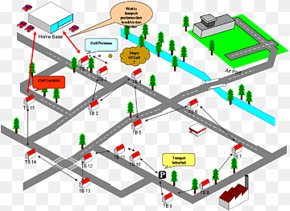

# SmartTrafficInsights
This is my dissertation project on how we can create real-time based traffic monitoring and signaling systems, with Machine Learning, a bit of Deep Learning, Neural Networks, and Machine Vision.
There is no particular dataset from where I have drawn my conclusion but I have made my own dataset which comprises a table of four directions in one intersection, NORTH SOUTH EAST, AND WEST, for every second in an hour, these directions can have one value from(0,1,2) depending on the amount of traffic, based on this we have 4 values every second, the amount of traffic is calculated by analyzing a single frame of a video of traffic camera's every 5 seconds so that we have a number of vehicles as unique and not overlapping which is a major problem to avoid when dealing with Video Analysis.
# SmartTrafficInsights

Welcome to the SmartTrafficInsights project! This repository contains code and resources for intelligent traffic data analysis using Google Colab.

## Table of Contents

- [About](#about)
- [Project Highlights](#project-highlights)
- [Project Structure](#project-structure)
- [Getting Started](#getting-started)
- [Usage](#usage)
- [Results](#results)
- [Contributing](#contributing)
- [License](#license)
- [Acknowledgements](#acknowledgements)

## About

SmartTrafficInsights is a data analysis project focused on intelligent traffic analysis. It uses the power of Google Colab to process, visualize, and gain insights from traffic-related data.

## Project Highlights

- Utilizes Jupyter Notebooks on Google Colab for interactive data analysis.
- Analyzes and visualizes traffic data to extract valuable insights.
- Provides a platform to experiment with various data analysis techniques.
- Facilitates easy collaboration and sharing of results.

## Project Structure

The project is organized as follows:

SmartTrafficInsights/
│
├── notebooks/ # Jupyter Notebooks for data analysis.
│ ├── Data_Preprocessing.ipynb
│ ├── Traffic_Analysis.ipynb
│ └── ...
│
├── data/ # Data files used in the analysis.
│ ├── traffic_data.csv
│ ├── road_network.geojson
│ └── ...
│
├── visuals/ # Visualizations and images related to the project.
│ ├── heatmap.png
│ ├── trend_plot.png
│ └── ...
│
├── project_banner.png # Project banner image for README.
├── LICENSE # Project license file.
└── README.md # Detailed project documentation.

## Getting Started

1. Clone this repository using `git clone https://github.com/your-username/SmartTrafficInsights.git`.
2. Navigate to the `notebooks` directory and open the Jupyter Notebooks using Google Colab.
3. Upload the necessary data files from the `data` directory into the Colab environment.

## Usage

1. Open the Jupyter Notebooks in the `notebooks` directory.
2. Follow the step-by-step instructions within the notebooks to perform data analysis tasks.
3. Modify and experiment with code cells to explore different analyses.

## Results

*Example Heatmap of Traffic Congestion*

Check out more results and visualizations in the [visuals](visuals/) directory.

## Contributing

Contributions to this project are always welcome. If you find any issues or have suggestions for improvements, feel free to create a pull request or open an issue.

## License

This project is licensed under the [MIT License](LICENSE).

## Acknowledgements

- This project was inspired by the need for smarter traffic insights in urban areas.
- We thank the open-source community for providing valuable libraries and tools that made this project possible.

